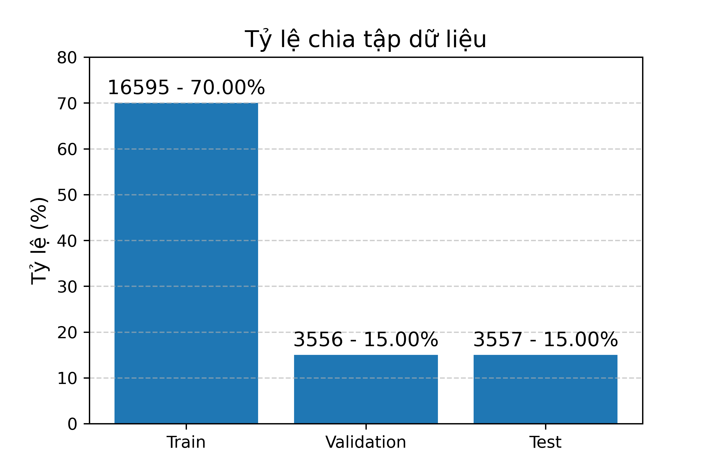
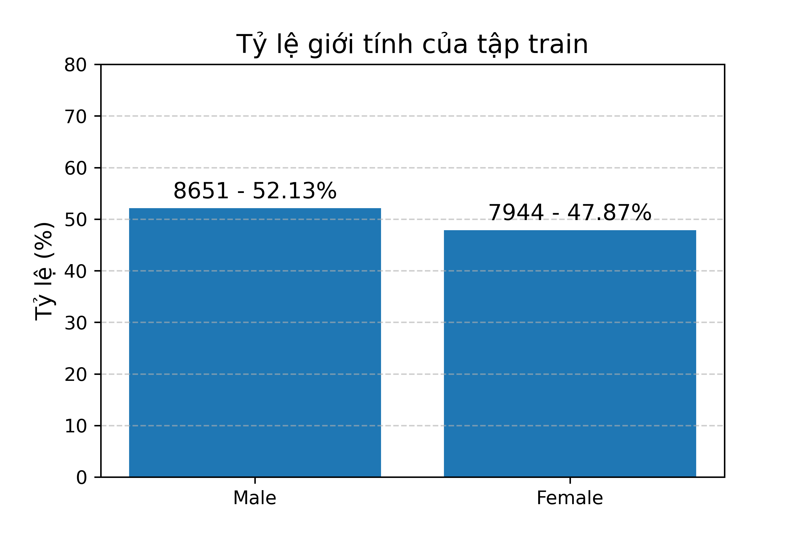
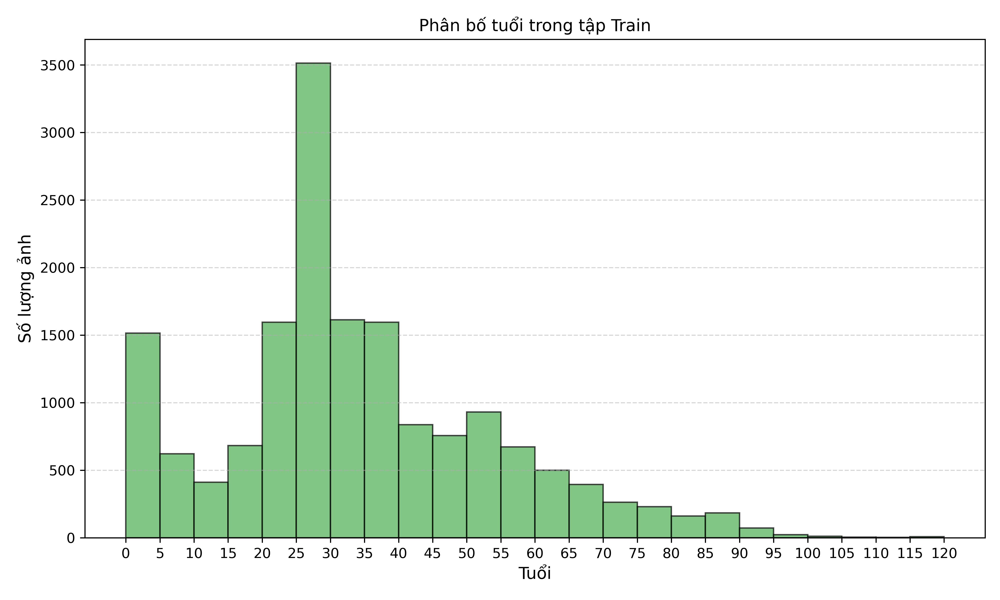

# Dữ liệu bài tập lớn xử lý ảnh

## Định dạng

labeled/train/img/...jpg

labeled/train/label.csv

labeled/valid/img/...jpg

labeled/valid/label.csv

labeled/test/img/...jpg

labeled/test/label.csv

### Định dạng csv (name, age, gender)

gender = 0: Nam

gender = 1: Nữ

## Mô tả

age: giá trị liên tục, mean = 33, min = 1, max = 116

gender: giá trị rời rạc (nhị phân)

## Trực quan

### Tỷ lệ chia

### Phân bố giới tính

### Phân bố tuổi
